# Basic Statistics
# Mean Median Mode

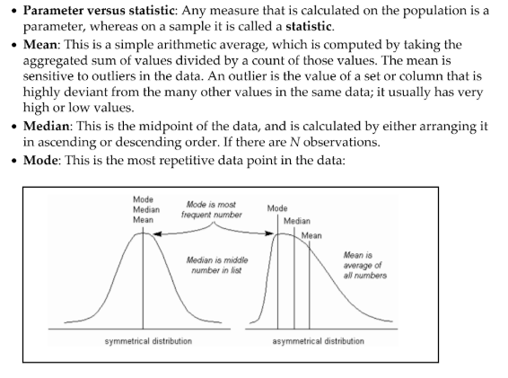


```python
import numpy as np
from scipy import stats
data = np.array([4,5,1,2,7,2,6,9,3])
data
```


    array([4, 5, 1, 2, 7, 2, 6, 9, 3])


```python
# Mean, Median, Mode Calculatoion Function
def mean_median_mode(data):
    # Calculate Mean
    dt_mean = np.mean(data) ; print ("Mean :",round(dt_mean,2))
    # Calculate Median                 
    dt_median = np.median(data) ; print ("Median :",dt_median)        
    # Calculate Mode                     
    dt_mode =  stats.mode(data); print ("Mode :",dt_mode[0][0])

mean_median_mode(data)
```

    Mean : 4.33
    Median : 4.0
    Mode : 2
    

# Variance, Standard Deviation,Range

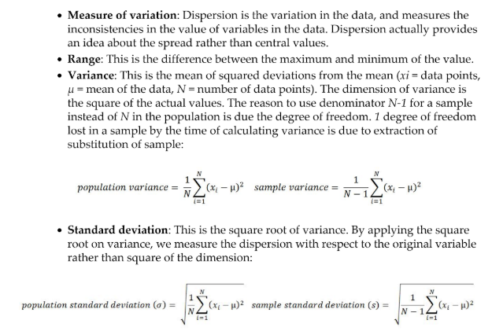


```python
import numpy as np
import statistics as st
```


```python
game_points = np.array([35,56,43,59,63,79,35,41,64,43,93,60,77,24,82])
game_points
```


    array([35, 56, 43, 59, 63, 79, 35, 41, 64, 43, 93, 60, 77, 24, 82])


```python
def variance(data):
    # Calculate Variance
    dt_var = st.variance(data) ; print ("Sample variance:", round(dt_var,2))
    # Calculate Standard Deviation
    dt_std = st.stdev(data) ; print ("Sample std.dev:",round(dt_std,2))
    # Calculate Range
    dt_rng = np.max(data,axis=0) - np.min(data,axis=0) ; print ("Range:",dt_rng)

variance(game_points)
```

    Sample variance: 400
    Sample std.dev: 20.0
    Range: 69
    

# Percentile, IQR

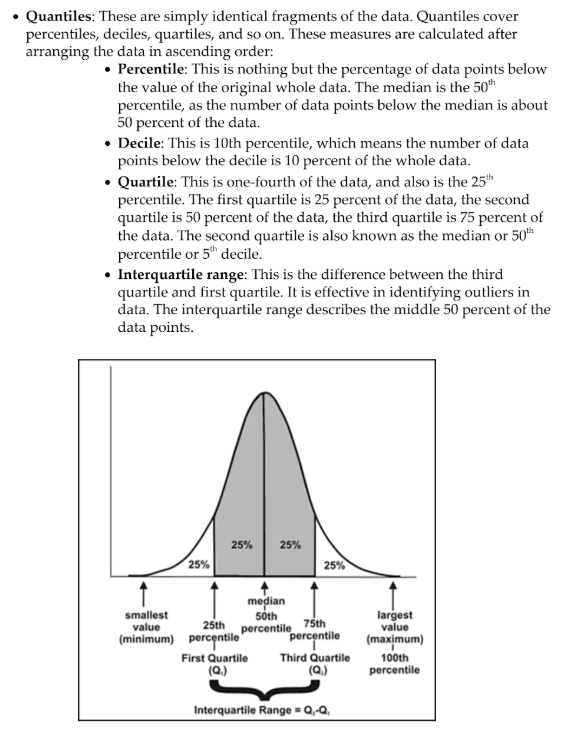


```python
print ("Quantiles:")
for val in [20,50,100]:
    dt_qntls = np.percentile(game_points,val) 
    print (str(val)+"%" ,dt_qntls)
                                
# Calculate IQR                           
q75, q25 = np.percentile(game_points, [75 ,25]); print ("Inter quartile range:",q75-q25 )
```

    Quantiles:
    20% 39.800000000000004
    50% 59.0
    100% 93.0
    Inter quartile range: 28.5
    

# Hypothesis testing

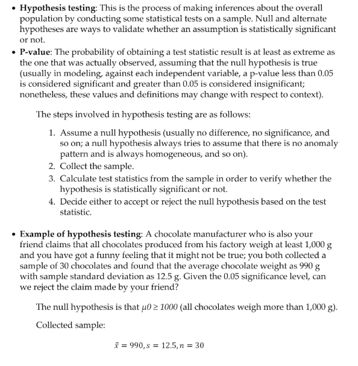


```python
from scipy import stats

xbar = 990; mu0 = 1000; s = 12.5; n = 30
# Test Statistic
t_smple  = (xbar-mu0)/(s/np.sqrt(float(n))); print ("Test Statistic:",round(t_smple,2))
# Critical value from t-table
alpha = 0.05
t_alpha = stats.t.ppf(alpha,n-1); print ("Critical value from t-table:",round(t_alpha,3))          
#Lower tail p-value from t-table                        
p_val = stats.t.sf(np.abs(t_smple), n-1); print ("Lower tail p-value from t-table", p_val)   
```

    Test Statistic: -4.38
    Critical value from t-table: -1.699
    Lower tail p-value from t-table 7.035025729010886e-05
    

# Normal Distribution

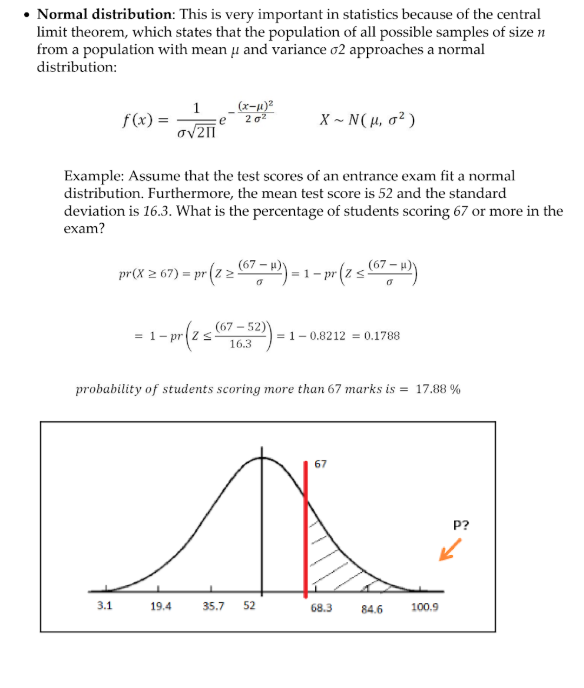


```python
def z_score(xbar, mu0, s):
    z = (xbar-mu0)/s
    print("z_score is :",round(z,4))
    prob = stats.norm.cdf(z)
    print("Probability of zscore : ", prob);print ("Prob. to score more than 67 is ",round(prob*100,2),"%")

z_score(67,52,16.3)
```

    z_score is : 0.9202
    Probability of zscore :  0.8212777324852483
    Prob. to score more than 67 is  82.13 %
    

# Chi Square test
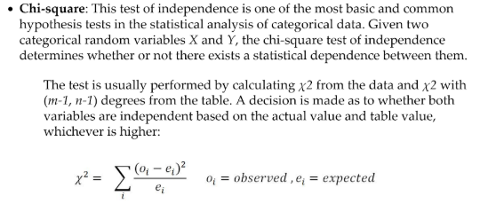


```python
import pandas as pd
from scipy import stats
```


```python
survey = pd.read_csv("survey.csv")
survey.head(5)
```


<div>
<style scoped>
    .dataframe tbody tr th:only-of-type {
        vertical-align: middle;
    }

    .dataframe tbody tr th {
        vertical-align: top;
    }

    .dataframe thead th {
        text-align: right;
    }
</style>
<table border="1" class="dataframe">
  <thead>
    <tr style="text-align: right;">
      <th></th>
      <th>Sex</th>
      <th>Wr.Hnd</th>
      <th>NW.Hnd</th>
      <th>W.Hnd</th>
      <th>Fold</th>
      <th>Pulse</th>
      <th>Clap</th>
      <th>Exer</th>
      <th>Smoke</th>
      <th>Height</th>
      <th>M.I</th>
      <th>Age</th>
    </tr>
  </thead>
  <tbody>
    <tr>
      <th>0</th>
      <td>Female</td>
      <td>18.5</td>
      <td>18.0</td>
      <td>Right</td>
      <td>R on L</td>
      <td>92.0</td>
      <td>Left</td>
      <td>Some</td>
      <td>Never</td>
      <td>173.0</td>
      <td>Metric</td>
      <td>18.250</td>
    </tr>
    <tr>
      <th>1</th>
      <td>Male</td>
      <td>19.5</td>
      <td>20.5</td>
      <td>Left</td>
      <td>R on L</td>
      <td>104.0</td>
      <td>Left</td>
      <td>None</td>
      <td>Regul</td>
      <td>177.8</td>
      <td>Imperial</td>
      <td>17.583</td>
    </tr>
    <tr>
      <th>2</th>
      <td>Male</td>
      <td>18.0</td>
      <td>13.3</td>
      <td>Right</td>
      <td>L on R</td>
      <td>87.0</td>
      <td>Neither</td>
      <td>None</td>
      <td>Occas</td>
      <td>NaN</td>
      <td>NaN</td>
      <td>16.917</td>
    </tr>
    <tr>
      <th>3</th>
      <td>Male</td>
      <td>18.8</td>
      <td>18.9</td>
      <td>Right</td>
      <td>R on L</td>
      <td>NaN</td>
      <td>Neither</td>
      <td>None</td>
      <td>Never</td>
      <td>160.0</td>
      <td>Metric</td>
      <td>20.333</td>
    </tr>
    <tr>
      <th>4</th>
      <td>Male</td>
      <td>20.0</td>
      <td>20.0</td>
      <td>Right</td>
      <td>Neither</td>
      <td>35.0</td>
      <td>Right</td>
      <td>Some</td>
      <td>Never</td>
      <td>165.0</td>
      <td>Metric</td>
      <td>23.667</td>
    </tr>
  </tbody>
</table>
</div>


```python
def Chi_square_test(Column1, Column2):
    # Tabulating 2 variables with row & column variables respectively
    survey_tab = pd.crosstab(Column1,Column2,margins=True)
    print(survey_tab)
    # Creating observed table for analysis
    observed = survey_tab.ix[0:4,0:3] 
#     print(observed)
    contg = stats.chi2_contingency(observed= observed)
#     print(contg)
    p_value = round(contg[1],3)
    print ("P-value is: ",p_value)
```


```python
Chi_square_test(survey.Smoke, survey.Clap)
```

    Clap   Left  Neither  Right  All
    Smoke                           
    Heavy     2        2      7   11
    Never    29       39    120  188
    Occas     3        6     10   19
    Regul     4        3     10   17
    All      38       50    147  235
    P-value is:  0.903
    

    C:\Users\ashish.patel\Anaconda3\lib\site-packages\ipykernel_launcher.py:6: DeprecationWarning: 
    .ix is deprecated. Please use
    .loc for label based indexing or
    .iloc for positional indexing
    
    See the documentation here:
    http://pandas.pydata.org/pandas-docs/stable/indexing.html#ix-indexer-is-deprecated
      
    

# Anova Model
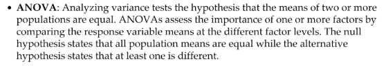


```python
import pandas as pd
from scipy import stats
```


```python
fetilizers = pd.read_csv("fetilizers.csv")
```


```python
one_way_anova = stats.f_oneway(fetilizers["fertilizer1"], fetilizers["fertilizer2"], fetilizers["fertilizer3"])
```


```python
print ("Statistic :", round(one_way_anova[0],2),", p-value :",round(one_way_anova[1],3))
```

    Statistic : 4.13 , p-value : 0.037
    

# Train and Test sample

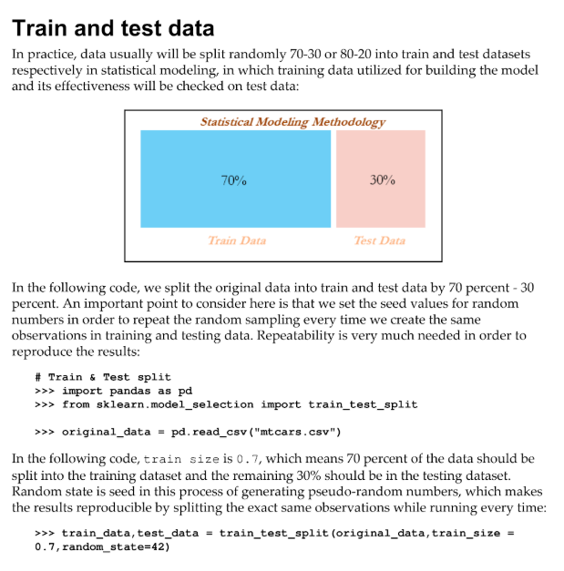


```python
# Train & Test split
import pandas as pd      
from sklearn.model_selection import train_test_split              
                        
original_data = pd.read_csv("mtcars.csv")     

train_data,test_data = train_test_split(original_data,train_size = 0.7,random_state=42)
```

    C:\Users\ashish.patel\Anaconda3\lib\site-packages\sklearn\model_selection\_split.py:2026: FutureWarning: From version 0.21, test_size will always complement train_size unless both are specified.
      FutureWarning)
    


```python
train_data.shape,test_data.shape
```


    ((22, 12), (10, 12))

# Confusion Matrix

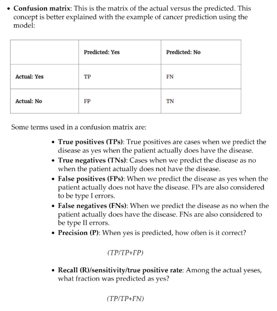

# Type-I-II Error
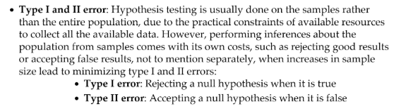

# Evaluation Metrices
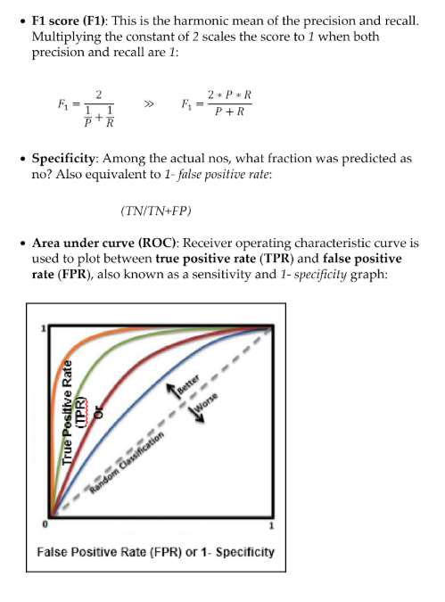

# Linear and Gradient Boosting  

- In the following code, a comparison has been made between applying linear regression in a statistical way and gradient descent in a machine learning way on the same dataset:


```python
import numpy as np                        
import pandas as pd
```


```python
train_data = pd.read_csv("mtcars.csv")
```


```python
print(train_data.shape)
train_data.head(5)
```

    (32, 12)
    


<div>
<style scoped>
    .dataframe tbody tr th:only-of-type {
        vertical-align: middle;
    }

    .dataframe tbody tr th {
        vertical-align: top;
    }

    .dataframe thead th {
        text-align: right;
    }
</style>
<table border="1" class="dataframe">
  <thead>
    <tr style="text-align: right;">
      <th></th>
      <th>Unnamed: 0</th>
      <th>mpg</th>
      <th>cyl</th>
      <th>disp</th>
      <th>hp</th>
      <th>drat</th>
      <th>wt</th>
      <th>qsec</th>
      <th>vs</th>
      <th>am</th>
      <th>gear</th>
      <th>carb</th>
    </tr>
  </thead>
  <tbody>
    <tr>
      <th>0</th>
      <td>Mazda RX4</td>
      <td>21.0</td>
      <td>6</td>
      <td>160.0</td>
      <td>110</td>
      <td>3.90</td>
      <td>2.620</td>
      <td>16.46</td>
      <td>0</td>
      <td>1</td>
      <td>4</td>
      <td>4</td>
    </tr>
    <tr>
      <th>1</th>
      <td>Mazda RX4 Wag</td>
      <td>21.0</td>
      <td>6</td>
      <td>160.0</td>
      <td>110</td>
      <td>3.90</td>
      <td>2.875</td>
      <td>17.02</td>
      <td>0</td>
      <td>1</td>
      <td>4</td>
      <td>4</td>
    </tr>
    <tr>
      <th>2</th>
      <td>Datsun 710</td>
      <td>22.8</td>
      <td>4</td>
      <td>108.0</td>
      <td>93</td>
      <td>3.85</td>
      <td>2.320</td>
      <td>18.61</td>
      <td>1</td>
      <td>1</td>
      <td>4</td>
      <td>1</td>
    </tr>
    <tr>
      <th>3</th>
      <td>Hornet 4 Drive</td>
      <td>21.4</td>
      <td>6</td>
      <td>258.0</td>
      <td>110</td>
      <td>3.08</td>
      <td>3.215</td>
      <td>19.44</td>
      <td>1</td>
      <td>0</td>
      <td>3</td>
      <td>1</td>
    </tr>
    <tr>
      <th>4</th>
      <td>Hornet Sportabout</td>
      <td>18.7</td>
      <td>8</td>
      <td>360.0</td>
      <td>175</td>
      <td>3.15</td>
      <td>3.440</td>
      <td>17.02</td>
      <td>0</td>
      <td>0</td>
      <td>3</td>
      <td>2</td>
    </tr>
  </tbody>
</table>
</div>


```python
X = np.array(train_data["hp"]); y = np.array(train_data["mpg"]) 
X = X.reshape(32,1); y = y.reshape(32,1)
```


```python
from sklearn.linear_model import LogisticRegression
model = LinearRegression(fit_intercept=True)
```


```python
model.fit(X,y)
print("Linear Regression Results")
print("Intercept", model.intercept_[0],"Coefficient", model.coef_[0])
```

    Linear Regression Results
    Intercept 30.098860539622496 Coefficient [-0.06822828]
    


```python
def gradient_descent(x, y,learn_rate, conv_threshold,batch_size,max_iter):    
    converged = False
    iter = 0
    m = batch_size 
    t0 = np.random.random(x.shape[1])
    t1 = np.random.random(x.shape[1])

    MSE = (sum([(t0 + t1*x[i] - y[i])**2 for i in range(m)])/ m)    

    while not converged:        
        grad0 = 1.0/m * sum([(t0 + t1*x[i] - y[i]) for i in range(m)]) 
        grad1 = 1.0/m * sum([(t0 + t1*x[i] - y[i])*x[i] for i in range(m)])

        temp0 = t0 - learn_rate * grad0
        temp1 = t1 - learn_rate * grad1
    
        t0 = temp0
        t1 = temp1

        MSE_New = (sum( [ (t0 + t1*x[i] - y[i])**2 for i in range(m)] ) / m)

        if abs(MSE - MSE_New ) <= conv_threshold:
            print ('Converged, iterations: ', iter)
            converged = True
    
        MSE = MSE_New   
        iter += 1 
    
        if iter == max_iter:
            print ('Max interactions reached')
            converged = True

    return t0,t1

if __name__ == '__main__':
    Inter, Coeff = gradient_descent(x = X,y = y,learn_rate=0.00003 ,conv_threshold=1e-8, batch_size=32,max_iter=2500)
    print ("Gradient Descent Results")
    print (('Intercept = %s Coefficient = %s') %(Inter, Coeff)) 
```

    Max interactions reached
    Gradient Descent Results
    Intercept = [1.29812886] Coefficient = [0.09381787]
    

# Train Validation Test split 


```python
import pandas as pd      
from sklearn.model_selection import train_test_split              
                        
original_data = pd.read_csv("mtcars.csv")                   
```


```python
def data_split(dat,trf = 0.5,vlf=0.25,tsf = 0.25):
    nrows = dat.shape[0]    
    trnr = int(nrows*trf)
    vlnr = int(nrows*vlf)    
    
    tr_data,rmng = train_test_split(dat,train_size = trnr,random_state=42)
    vl_data, ts_data = train_test_split(rmng,train_size = vlnr,random_state=45)  
    
    return (tr_data,vl_data,ts_data)
```


```python
train_data, validation_data, test_data = data_split(original_data,trf=0.5,vlf=0.25,tsf=0.25)
```

    C:\Users\ashish.patel\Anaconda3\lib\site-packages\sklearn\model_selection\_split.py:2026: FutureWarning: From version 0.21, test_size will always complement train_size unless both are specified.
      FutureWarning)
    

# Decision Tree


```python
# Grid search on Decision Trees
import pandas as pd
from sklearn.tree import DecisionTreeClassifier
from sklearn.model_selection import train_test_split,GridSearchCV
from sklearn.metrics import classification_report,confusion_matrix,accuracy_score
from sklearn.pipeline import Pipeline
```


```python
input_data = pd.read_csv("ad.csv", header=None)
input_data.head(5)
```


<div>
<style scoped>
    .dataframe tbody tr th:only-of-type {
        vertical-align: middle;
    }

    .dataframe tbody tr th {
        vertical-align: top;
    }

    .dataframe thead th {
        text-align: right;
    }
</style>
<table border="1" class="dataframe">
  <thead>
    <tr style="text-align: right;">
      <th></th>
      <th>0</th>
      <th>1</th>
      <th>2</th>
      <th>3</th>
      <th>4</th>
      <th>5</th>
      <th>6</th>
      <th>7</th>
      <th>8</th>
      <th>9</th>
      <th>...</th>
      <th>1549</th>
      <th>1550</th>
      <th>1551</th>
      <th>1552</th>
      <th>1553</th>
      <th>1554</th>
      <th>1555</th>
      <th>1556</th>
      <th>1557</th>
      <th>1558</th>
    </tr>
  </thead>
  <tbody>
    <tr>
      <th>0</th>
      <td>125</td>
      <td>125</td>
      <td>1.0000</td>
      <td>1</td>
      <td>0</td>
      <td>0</td>
      <td>0</td>
      <td>0</td>
      <td>0</td>
      <td>0</td>
      <td>...</td>
      <td>0</td>
      <td>0</td>
      <td>0</td>
      <td>0</td>
      <td>0</td>
      <td>0</td>
      <td>0</td>
      <td>0</td>
      <td>0</td>
      <td>1</td>
    </tr>
    <tr>
      <th>1</th>
      <td>57</td>
      <td>468</td>
      <td>8.2105</td>
      <td>1</td>
      <td>0</td>
      <td>0</td>
      <td>0</td>
      <td>0</td>
      <td>0</td>
      <td>0</td>
      <td>...</td>
      <td>0</td>
      <td>0</td>
      <td>0</td>
      <td>0</td>
      <td>0</td>
      <td>0</td>
      <td>0</td>
      <td>0</td>
      <td>0</td>
      <td>1</td>
    </tr>
    <tr>
      <th>2</th>
      <td>33</td>
      <td>230</td>
      <td>6.9696</td>
      <td>1</td>
      <td>0</td>
      <td>0</td>
      <td>0</td>
      <td>0</td>
      <td>0</td>
      <td>0</td>
      <td>...</td>
      <td>0</td>
      <td>0</td>
      <td>0</td>
      <td>0</td>
      <td>0</td>
      <td>0</td>
      <td>0</td>
      <td>0</td>
      <td>0</td>
      <td>1</td>
    </tr>
    <tr>
      <th>3</th>
      <td>60</td>
      <td>468</td>
      <td>7.8000</td>
      <td>1</td>
      <td>0</td>
      <td>0</td>
      <td>0</td>
      <td>0</td>
      <td>0</td>
      <td>0</td>
      <td>...</td>
      <td>0</td>
      <td>0</td>
      <td>0</td>
      <td>0</td>
      <td>0</td>
      <td>0</td>
      <td>0</td>
      <td>0</td>
      <td>0</td>
      <td>1</td>
    </tr>
    <tr>
      <th>4</th>
      <td>60</td>
      <td>468</td>
      <td>7.8000</td>
      <td>1</td>
      <td>0</td>
      <td>0</td>
      <td>0</td>
      <td>0</td>
      <td>0</td>
      <td>0</td>
      <td>...</td>
      <td>0</td>
      <td>0</td>
      <td>0</td>
      <td>0</td>
      <td>0</td>
      <td>0</td>
      <td>0</td>
      <td>0</td>
      <td>0</td>
      <td>1</td>
    </tr>
  </tbody>
</table>
<p>5 rows × 1559 columns</p>
</div>


```python
X_columns = set(input_data.columns.values)
y = input_data[len(input_data.columns.values)-1]
X_columns.remove(len(input_data.columns.values)-1)
X = input_data[list(X_columns)]
```


```python
X_train, X_test,y_train,y_test = train_test_split(X,y,train_size = 0.7,random_state=33)
pipeline = Pipeline([
    ('clf', DecisionTreeClassifier(criterion='entropy'))
])
```

    C:\Users\ashish.patel\Anaconda3\lib\site-packages\sklearn\model_selection\_split.py:2026: FutureWarning: From version 0.21, test_size will always complement train_size unless both are specified.
      FutureWarning)
    


```python
parameters = {
    'clf__max_depth': (50,100,150),
    'clf__min_samples_split': (2, 3),
    'clf__min_samples_leaf': (1, 2, 3)
}
```


```python
grid_search = GridSearchCV(pipeline, parameters, n_jobs=-1, verbose=1, scoring='accuracy')
grid_search.fit(X_train, y_train)
```

    Fitting 3 folds for each of 18 candidates, totalling 54 fits
    

    [Parallel(n_jobs=-1)]: Done  42 tasks      | elapsed:    4.8s
    [Parallel(n_jobs=-1)]: Done  54 out of  54 | elapsed:    5.7s finished
    


    GridSearchCV(cv=None, error_score='raise',
           estimator=Pipeline(memory=None,
         steps=[('clf', DecisionTreeClassifier(class_weight=None, criterion='entropy', max_depth=None,
                max_features=None, max_leaf_nodes=None,
                min_impurity_decrease=0.0, min_impurity_split=None,
                min_samples_leaf=1, min_samples_split=2,
                min_weight_fraction_leaf=0.0, presort=False, random_state=None,
                splitter='best'))]),
           fit_params=None, iid=True, n_jobs=-1,
           param_grid={'clf__max_depth': (50, 100, 150), 'clf__min_samples_split': (2, 3), 'clf__min_samples_leaf': (1, 2, 3)},
           pre_dispatch='2*n_jobs', refit=True, return_train_score='warn',
           scoring='accuracy', verbose=1)


```python
y_pred = grid_search.predict(X_test)
```


```python
print ('\n Best score: \n', grid_search.best_score_)
print ('\n Best parameters set: \n')
best_parameters = grid_search.best_estimator_.get_params()
for param_name in sorted(parameters.keys()):
    print ('\t%s: %r' % (param_name, best_parameters[param_name]))
print ("\n Confusion Matrix on Test data \n",confusion_matrix(y_test,y_pred))
print ("\n Test Accuracy \n",accuracy_score(y_test,y_pred))
print ("\nPrecision Recall f1 table \n",classification_report(y_test, y_pred))
```

    
     Best score: 
     0.966884531590414
    
     Best parameters set: 
    
    	clf__max_depth: 100
    	clf__min_samples_leaf: 1
    	clf__min_samples_split: 2
    
     Confusion Matrix on Test data 
     [[815  18]
     [ 16 135]]
    
     Test Accuracy 
     0.9654471544715447
    
    Precision Recall f1 table 
                  precision    recall  f1-score   support
    
              0       0.98      0.98      0.98       833
              1       0.88      0.89      0.89       151
    
    avg / total       0.97      0.97      0.97       984
    
    
